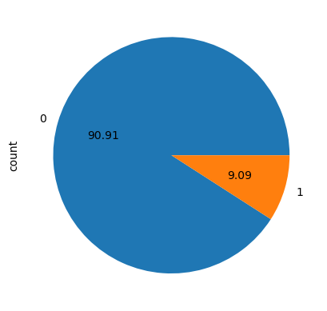
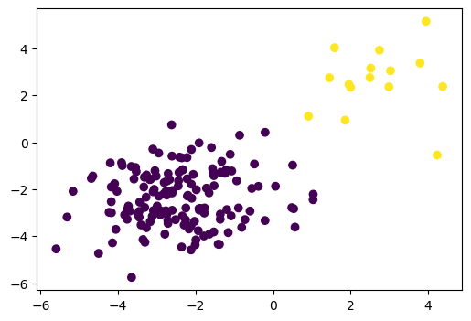
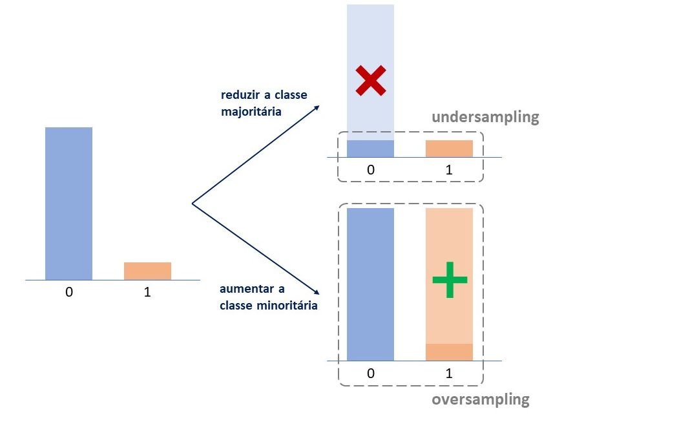
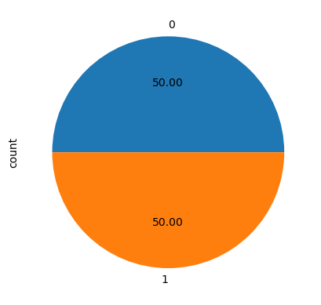
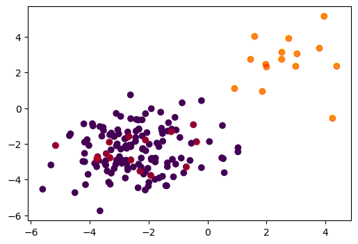
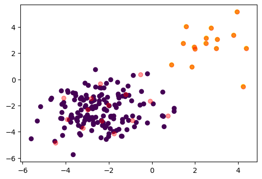
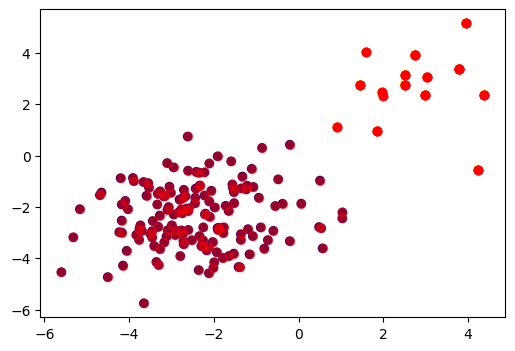
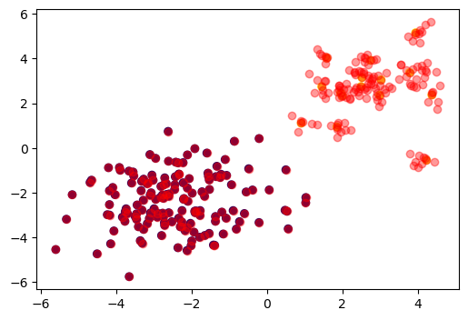
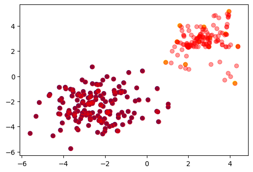
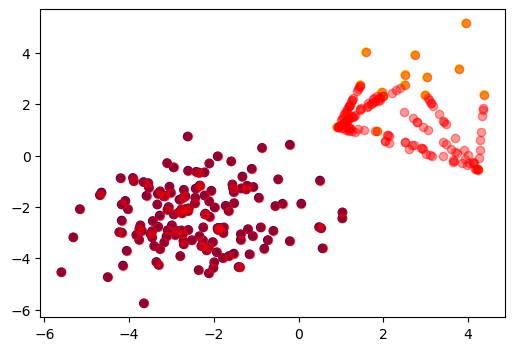

# Trabalhando com datasets desbalanceados


### Apresentação
Neste exemplo serão mostradas técnicas para análise e balanceamento de conjuntos de dados desbalanceados

- Vamos começar usando uma base simples para entender os conceitos
- Incialmente faremos uma análise do conjunto de dados da base
- Para trabalhar com datasets desbalanceados, vamos utilizar a biblioteca [**imbalanced-learn**](https://imbalanced-learn.org/stable/index.html)

### Arquivos de exemplo utilizados no projeto
- [BaseInadimplencia.xlsx](BaseInadimplencia.xlsx)

## Configurando o ambiente:

### Passo 1
Primeiramente, faça o download do projeto:
```bash
git clone https://github.com/andviana/imbalanced_learn_example.git
```

### Passo 2
Agora, entre na pasta do projeto e abra a sua IDE (os comandos abaixo abrirão o Visual Studio Code na pasta raiz do projeto)
```bash
cd imbalanced_learn_example
code .
```

### Passo 3 (opcional)
Se precisar criar um ambiente virtual, no terminal, execute os comandos:
> *a criação do venv é um passo necessário no **Ubuntu 24**, bem como em outras distros linux*
```bash
python3 -m venv .venv
source .venv/bin/activate
```
Para desativar o ambiente virtual (venv), use o comando abaixo:
> *não execute esse comando agora, pois caso seja o venv seja desativado, problemas podem ocorrer ao tentar instalar as dependências do projeto com o* ```pip```
```bash
deactivate
```

### Passo 4
No terminal do seu IDE, execute a instalação do [Pandas](https://pandas.pydata.org/docs/user_guide/index.html), [Matplotlib](https://matplotlib.org/) e [Imbalanced-learn](https://imbalanced-learn.org/stable/index.html) conforme comandos abaixo:
```bash
pip install pandas
pip install matplotlib
pip install -U imbalanced-learn
```

## Códigos do Exemplo

```python
# importando a base
import pandas as pd
ARQUIVO = 'dados/BaseInadimplencia.xlsx'
base = pd.read_excel(ARQUIVO)
```


```python
# Visualizando essa base
base.head(3)
```


<div>
<style scoped>
    .dataframe tbody tr th:only-of-type {
        vertical-align: middle;
    }

    .dataframe tbody tr th {
        vertical-align: top;
    }

    .dataframe thead th {
        text-align: right;
    }
</style>
<table border="1" class="dataframe">
  <thead>
    <tr style="text-align: right;">
      <th></th>
      <th>SaldoConta</th>
      <th>SaldoInvestimento</th>
      <th>Situacao</th>
    </tr>
  </thead>
  <tbody>
    <tr>
      <th>0</th>
      <td>-1.365390</td>
      <td>-3.280278</td>
      <td>0</td>
    </tr>
    <tr>
      <th>1</th>
      <td>-1.992492</td>
      <td>-4.158429</td>
      <td>0</td>
    </tr>
    <tr>
      <th>2</th>
      <td>-3.910816</td>
      <td>-0.874096</td>
      <td>0</td>
    </tr>
  </tbody>
</table>
</div>


```python
# contando a quantidade de valores
base.Situacao.value_counts()
```

output:

    Situacao
    0    150
    1     15
    Name: count, dtype: int64


```python
# Visualizando os dados graficamente
base.Situacao.value_counts().plot.pie(autopct='%.2f')
```
output:

    <Axes: ylabel='count'>
    



```python
# Visualizando a distribuição dos dados
import matplotlib.pyplot as plt
fig, ax = plt.subplots(figsize=(6,4))

ax.scatter(base.SaldoConta, base.SaldoInvestimento, c=base.Situacao)

plt.show()
```
   

    

## Como podemos resolver esse problema?

Temos 2 classes:
- **Classe Majoritária**: a que possui mais registros
- **Classe Minoritária**: a que possui menos registros

- undersampling: reduzir a classe majoritária
- oversampling: aumentar a classe minotitária (perigo de overfitting)



```python
# Instalando a biblioteca
!pip install -U imbalanced-learn
```
output:

    Requirement already satisfied: imbalanced-learn in c:\users\anderson\anaconda3\lib\site-packages (0.12.3)
    Requirement already satisfied: numpy>=1.17.3 in c:\users\anderson\anaconda3\lib\site-packages (from imbalanced-learn) (1.26.4)
    Requirement already satisfied: scipy>=1.5.0 in c:\users\anderson\anaconda3\lib\site-packages (from imbalanced-learn) (1.13.1)
    Requirement already satisfied: scikit-learn>=1.0.2 in c:\users\anderson\anaconda3\lib\site-packages (from imbalanced-learn) (1.4.2)
    Requirement already satisfied: joblib>=1.1.1 in c:\users\anderson\anaconda3\lib\site-packages (from imbalanced-learn) (1.4.2)
    Requirement already satisfied: threadpoolctl>=2.0.0 in c:\users\anderson\anaconda3\lib\site-packages (from imbalanced-learn) (2.2.0)
    

### Reduzindo os registros da classe majoritária
Vamos retirar dados da classe que possui mais registros:
- Precisamos ter cuidado para que essa retirada não acabe causando perda de informação (retirando informações que são muito importantes)
- Também é necessário verificar o tamnho da base restante
- Podemos começar fazendo isso excluindo registros de forma aleatória com o **RandomUnderSampler**


```python
# Sepandando X e y
X = base.drop('Situacao', axis=1)
y = base.Situacao
```


```python
# Definindo o RandonUnderSampler
from imblearn.under_sampling import RandomUnderSampler
rus = RandomUnderSampler(random_state=42)

```


```python
# Definindo a nova amostra
X_res, y_res = rus.fit_resample(X,y)
```


```python
# Contando os valores
y_res.value_counts()
```


output:

    Situacao
    0    15
    1    15
    Name: count, dtype: int64


```python
# visualizando graficamente
y_res.value_counts().plot.pie(autopct='%.2f')
```


output:

    <Axes: ylabel='count'>
    



```python
# Visualizando a distribuição dos dados
import matplotlib.pyplot as plt
fig, ax = plt.subplots(figsize=(6,4))

ax.scatter(base.SaldoConta, base.SaldoInvestimento, c=base.Situacao)
ax.scatter(X_res.SaldoConta, X_res.SaldoInvestimento, c='red', alpha=0.4)

plt.show()
```
    

    

Podemos tambem substituir um conjunto de amostras (um cluester) pelo seu centróide utilizando o **ClusterCentroids**


```python
# importação
from imblearn.under_sampling import ClusterCentroids
```


```python
# definindo o ClusterCentroids
cc = ClusterCentroids(random_state=42)
```


```python
# criando a amostra dos dados
X_res, y_res = cc.fit_resample(X,y)
```
output:

    C:\Users\Anderson\anaconda3\Lib\site-packages\sklearn\cluster\_kmeans.py:1446: UserWarning: KMeans is known to have a memory leak on Windows with MKL, when there are less chunks than available threads. You can avoid it by setting the environment variable OMP_NUM_THREADS=1.
      warnings.warn(
    


```python
# visualizando graficamente
fig, ax = plt.subplots(figsize=(6,4))

ax.scatter(base.SaldoConta, base.SaldoInvestimento, c=base.Situacao)
ax.scatter(X_res.SaldoConta, X_res.SaldoInvestimento, c='red', alpha=0.4)

plt.show()
```
    

    


Ou utilizar o **NearMiss** para manter apenas os pontos com **Menor distancia aos pontos da classe minoritária**

Nesse caso, vai retirar os pontos mas continuar mantendo a região de separação entre as classes


```python
# fazendo a reamostragem utilizando o NearMiss
from imblearn.under_sampling import NearMiss

```


```python
# Definindo o NearMiss
nm = NearMiss()
```


```python
# criando a amostra dos dados
X_res, y_res = nm.fit_resample(X,y)
```


```python
# visualizando graficamente
fig, ax = plt.subplots(figsize=(6,4))

ax.scatter(base.SaldoConta, base.SaldoInvestimento, c=base.Situacao)
ax.scatter(X_res.SaldoConta, X_res.SaldoInvestimento, c='red', alpha=0.4)

plt.show()

```
   


Existem várias outras formas de fazermos o undersampling e todas elas são explicadas na própria documentação

### Aumentando os registros da classe minoritária
Podemos **gerar novos valores** baseado nos atuais registros da base de dados, seja apenas duplicando os valores ou utilizando outros métodos como o KNN para criar novos pontos.

Precisamos garantir que não vamos ter overfitting por mostrar ao modelo várias vezes dados semelhantes.

Podemos começar gerando os registros de forma aleatória com o RandomOverSampler.


```python
# importando
from imblearn.over_sampling import RandomOverSampler
```


```python
# definindo o RandomOverSampler
ros = RandomOverSampler(random_state=42)
```


```python
# Refazendo nossa amostra
X_res, y_res = ros.fit_resample(X,y)
```


```python
# Contando os valores
y_res.value_counts()
```

output: 

    Situacao
    0    150
    1    150
    Name: count, dtype: int64


```python
# Visualizando graficamente
y_res.value_counts().plot.pie(autopct='%.2f')
```


output:

    <Axes: ylabel='count'>
    

    


```python
# visualizando graficamente
fig, ax = plt.subplots(figsize=(6,4))

ax.scatter(base.SaldoConta, base.SaldoInvestimento, c=base.Situacao)
ax.scatter(X_res.SaldoConta, X_res.SaldoInvestimento, c='red', alpha=0.4)

plt.show()

```
    

    


### Se a repetição dos dados for um problema, podemos utilizar o parametro shrinkage
quando o parametro for passado, ele vai gerar uma "suavização" nos dados


```python
# definindo o ros
ros = RandomOverSampler(random_state=42, shrinkage=0.5)
```


```python
# Refazendo nossa amostra
X_res, y_res = ros.fit_resample(X,y)

```


```python
# visualizando graficamente
fig, ax = plt.subplots(figsize=(6,4))

ax.scatter(base.SaldoConta, base.SaldoInvestimento, c=base.Situacao)
ax.scatter(X_res.SaldoConta, X_res.SaldoInvestimento, c='red', alpha=0.4)

plt.show()


```
    

    

outra opção é utilizarmos o SMOTE ou ADASYN, quye vai utilizar o KNN para gerar novos registros em uma distência açeatória entre o ponto de dado e um dos seus k vizinhos mais próximos

enquanto o SMOTE vai considerar todos os pontos sem distinção, o ADASYN vai gerar mais observações para aqueles pontos da classe minoritária que tiverem mais observações da classe majoritária na região dos vizinhos mais próximos


```python
# utilizando o SMOTE
from imblearn.over_sampling import SMOTE
s= SMOTE(random_state=42)
X_res, y_res = s.fit_resample(X,y)

```


```python
# visualizando graficamente
fig, ax = plt.subplots(figsize=(6,4))

ax.scatter(base.SaldoConta, base.SaldoInvestimento, c=base.Situacao)
ax.scatter(X_res.SaldoConta, X_res.SaldoInvestimento, c='red', alpha=0.4)

plt.show()
```
   

    

```python
# utilizando o ADASYN
from imblearn.over_sampling import ADASYN
a= ADASYN(random_state=42)
X_res, y_res = a.fit_resample(X,y)

```


```python
# visualizando graficamente
fig, ax = plt.subplots(figsize=(6,4))

ax.scatter(base.SaldoConta, base.SaldoInvestimento, c=base.Situacao)
ax.scatter(X_res.SaldoConta, X_res.SaldoInvestimento, c='red', alpha=0.4)

plt.show()
```
   

    

### Considerações Finais:

Existem várias outras formas de fazermos o **oversampling** e todas elas são explicadas na própria **documentação**:
- https://imbalanced-learn.org/stable/over_sampling.html


### Proximos passos:
Como sugestão, você pode utilizar essa **base real de [dados de cartão de crédito do Kaggle](https://www.kaggle.com/datasets/mlg-ulb/creditcardfraud)** para treinar as técnicas demonstradas


### Referências
- [Biblioteca Pandas](https://pandas.pydata.org/docs/user_guide/index.html) 
- [Biblioteca Matplotlib](https://matplotlib.org/)
- [Bibluioteca Imbalanced-learn](https://imbalanced-learn.org/stable/index.html)
- [Hashtag Treinamentos](https://www.youtube.com/watch?v=kE9gYQDyVr0)
